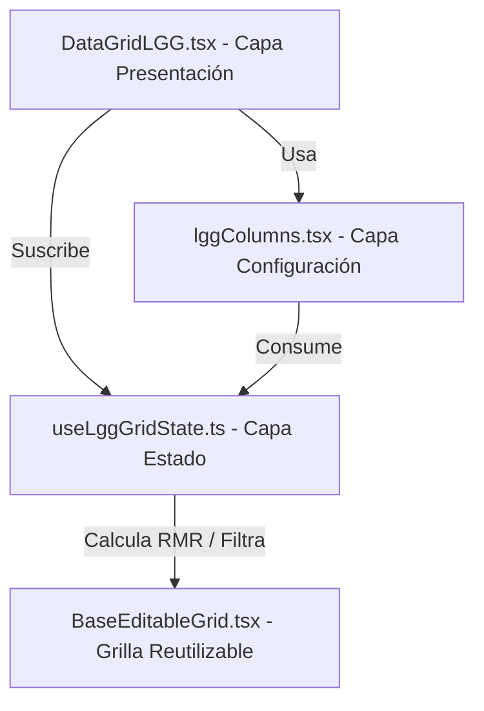

# Especificación de Diseño de Software y Arquitectura - Geolog Pro 2.0

Este documento detalla la arquitectura de software y las decisiones de diseño aplicadas al módulo de **Logueo Geotécnico General (LGG)**. Sirve como la **guía oficial** y patrón de referencia obligatorio para el desarrollo, migración y mantenimiento de los demás módulos del sistema (Logueo Estructural y Ensayos PLT).

---

## 1. Filosofía de Arquitectura de Geolog Pro 2.0

El rediseño del sistema persigue tres objetivos fundamentales:
1.  **Mantener archivos pequeños y legibles (< 900 líneas):** Evitar la creación de componentes monolíticos difíciles de depurar y mantener.
2.  **Principio de Responsabilidad Única (SRP):** Cada archivo debe tener una sola razón de cambio. Lógicas matemáticas o de estilos no deben mezclarse con la interfaz de usuario.
3.  **Bajo Acoplamiento y Alta Cohesión:** Los componentes deben ser autocontenidos y comunicarse mediante contratos de propiedades (props) estrictos.

---

## 2. Estructura de Carpetas por Característica (Feature Folder Pattern)

Cada módulo geotécnico se organiza bajo su propia carpeta funcional en `src/features/<feature_name>/`. Esta es la estructura estándar que deben seguir **Estructural** y **PLT**:

```bash
src/features/lgg/
├── components/                  # Modales, diálogos y subcomponentes locales
│   ├── CollarModals.tsx         # Formularios de creación y renombrado de sondajes
│   └── LggExportModal.tsx       # Interfaz y lógica de exportación a XLSX
├── useLggGridState.ts           # Capa de Estado: Hook con lógica matemática y RMR
├── lggColumns.tsx               # Capa de Configuración: Definición de columnas y estilos
├── DataGridLGG.tsx              # Capa de Presentación: Layout y controlador del Grid
├── ExcelImportModal.tsx         # Modal especializado para parsear y mapear XLSX
└── QaqcAnalysisPanel.tsx        # Panel de reportes de calidad y validación local
```

---

## 3. Patrón de las Tres Capas Fundamentales

La refactorización de LGG dividió la grilla en tres capas desacopladas que interactúan de forma limpia:



### Capa 1: Presentación e Interfaz (`DataGridLGG.tsx`)
*   **Rol:** Funciona puramente como el layout del módulo. Contiene el contenedor scrollable, las barras de herramientas superiores, las tarjetas de KPI del dashboard y las instancias de diálogos flotantes.
*   **Regla de Oro:** **No debe contener lógica de negocio**. No debe realizar promedios matemáticos directamente sobre los estados, ni procesar buffers de archivos Excel. Llama a funciones provistas por las capas inferiores.

### Capa 2: Configuración del Grid (`lggColumns.tsx`)
*   **Rol:** Centralizar el Schema de las columnas de la tabla.
*   **Diseño:** Se exporta una función pura `getLggColumns` que recibe dependencias e inyecta propiedades especiales:
    *   `width`: Anchos configurables.
    *   `type`: Especificación de si el input es numérico, texto, de solo lectura, o un combobox de selección.
    *   `renderCell`: Método para pintar celdas con personalizaciones complejas (como selectores de colores según catálogos).
*   **Beneficio:** Si se añaden nuevas columnas o se cambian los estilos visuales de las celdas, solo se modifica este archivo.

### Capa 3: Estado y Lógica Geomecánica (`useLggGridState.ts`)
*   **Rol:** Manejar el ciclo de vida del estado de las filas y ejecutar los motores de cálculo en tiempo real.
*   **Lógica Encapsulada:**
    *   Agregar filas y autocompletar la profundidad inicial (`de: N = a: N-1`).
    *   Eliminación y reordenamiento de secuencias.
    *   Cálculo reactivo del RMR'76, RMR'89 e índices de calidad a partir de los datos modificados.
    *   Búsqueda y filtros de visualización (por litología, geólogo, etc.).
*   **Beneficio:** Permite probar el comportamiento lógico del grid mediante tests unitarios de React hooks sin necesidad de levantar o renderizar el DOM del navegador.

---

## 4. Desacoplamiento de Componentes Auxiliares

Cualquier pop-up, modal, importador o exportador pesado debe residir en su propio archivo funcional:

*   **Exportación a Excel (`LggExportModal.tsx`):**
    Aísla la biblioteca de peso `xlsx`. Para evitar pasar variables y callbacks redundantes en los props, el exportador lee la cabecera interactuando de forma controlada con el DOM (`document.getElementById`). Así, los metadatos dinámicos del collar no ensucian el estado global del grid.
*   **Modales de Diálogos (`CollarModals.tsx`):**
    Controlados declarativamente mediante un booleano `isOpen` y callbacks del tipo `onCreate` y `onRename`.

---

## 5. Checklist para Replicar este Patrón en Estructural y PLT

Cuando migres o construyas los módulos de **Logueo Estructural** y **Ensayos PLT**, sigue estos pasos estrictos:

- [ ] **Paso 1: Centralización de Opciones en `catalogData.ts`**
  Antes de codificar la tabla, asegúrate de que todos los comboboxes y selectores utilicen catálogos que residan en `src/utils/catalogData.ts`. Queda prohibido definir arreglos estáticos locales de opciones dentro del componente de UI.
- [ ] **Paso 2: Creación del Custom Hook de Estado**
  Crea `useStructuralState.ts` o `usePltState.ts` utilizando TypeScript. Define las funciones para agregar registros, removerlos, y realizar cálculos matemáticos locales (por ejemplo, calcular la rotura, factor K o UCS en PLT en tiempo real).
- [ ] **Paso 3: Creación de la Configuración de Columnas**
  Crea `structuralColumns.tsx` o `pltColumns.tsx`. Exporta una función `getStructuralColumns` que defina el schema del grid. Usa `renderCell` solo para comportamientos interactivos complejos.
- [ ] **Paso 4: Ensamblar en el Componente Principal usando `BaseEditableGrid`**
  En el componente de presentación principal, suscríbete al hook de estado, genera las columnas memoizadas e inyecta ambos en `<BaseEditableGrid ... />`.
- [ ] **Paso 5: Extraer Modales Auxiliares**
  Mueve la lógica de XLSX, importadores manuales y diálogos complejos a archivos independientes en la carpeta `/components` local.
- [ ] **Paso 6: Validar Compilación Estática y Renderizado**
  Corre `npx tsc --noEmit` para asegurar que el sistema esté libre de warnings y de tipado estricto.

---

## 6. Rendimiento y Resiliencia en la Carga de Datos

El grid reutilizable `BaseEditableGrid` incorpora por defecto:
1.  **Virtualización del DOM:** Dibuja únicamente las filas en el área visible. Los otros módulos heredarán este beneficio de forma automática al usar el grid base.
2.  **Memoización de Renderizado:** Las celdas se configuran para que solo se re-renderice la fila activa que el usuario está editando, garantizando una latencia de actualización de 0ms.
