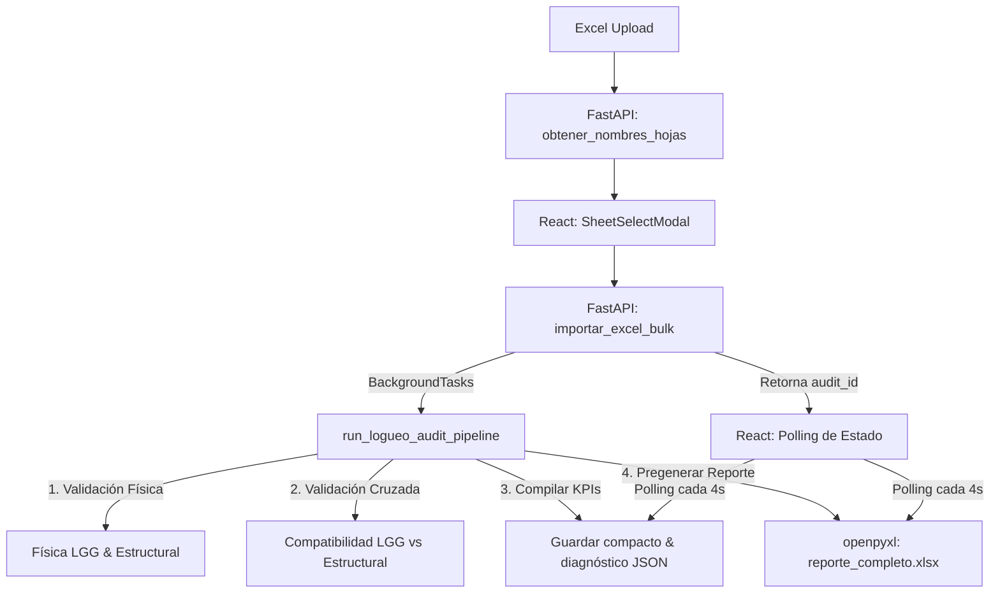

# Arquitectura del Módulo de Auditoría Geomecánica Masiva

Este documento detalla el diseño de software, la flujo de datos y la organización técnica del módulo de **Auditoría Masiva** en **Geolog Pro 2.0**.

---

## 🗺️ Visión General de la Arquitectura

El módulo de auditoría es un sistema híbrido reactivo/asíncrono diseñado para procesar y auditar planillas de logueo de gran tamaño (libros Excel con miles de filas) sin bloquear la experiencia del usuario (UX) en el navegador.

---

## 1. Backend (FastAPI / Python)

Ubicación principal: [auditoria.py](file:///c:/Users/Rafael/UNSA/Projects/Ing.%20Materiales/avance_v.1.4/backend/app/routers/auditoria.py)

### Pipeline de Auditoría Asíncrono
Cuando se inicia una importación, FastAPI recibe la solicitud y delega la tarea de validación completa a la cola de `BackgroundTasks` de Python. Esto permite que la solicitud HTTP responda de inmediato (`202 Accepted`), retornando un identificador de auditoría (`audit_id`).

El proceso se divide en las siguientes etapas principales:
1.  **Validación de consistencia física individual:** Se analizan los metrajes de avance en LGG, que no se superen las longitudes de corrida (1.6m), consistencia del RQD y balance físico de fragmentos.
2.  **Validación espacial cruzada:** Mapea las discontinuidades cargadas en la hoja structural con sus respectivas corridas geológicas en LGG mediante rangos de profundidad (`LGG.de <= Estructura.Profundidad < LGG.a`).
3.  **Compilación de KPIs y Resúmenes:** Agrupa las desviaciones por tipología, campaña, responsable y taladro, guardando el resultado en `{audit_id}_diagnostico.json` y `{audit_id}_compact.json`.
4.  **Pre-generación de Reporte Formateado (openpyxl):** Compila un libro de Excel con formato profesional, colores ejecutivos, KPIs en tarjetas y tablas de distribución, almacenándolo en el disco (`{audit_id}_reporte_completo.xlsx`).

### Endpoint de Cancelación
*   `POST /api/logueo/cancelar-auditoria?audit_id=...`
*   **Mecánica:** Borra físicamente del disco del servidor los archivos temporales y reportes de la auditoría seleccionada. Permite al usuario abortar un análisis y liberar espacio inmediatamente.

---

## 2. Frontend (React / TypeScript / Tailwind CSS)

Ubicación principal: [features/auditor/](file:///c:/Users/Rafael/UNSA/Projects/Ing.%20Materiales/avance_v.1.4/frontend/src/features/auditor)

Hemos desacoplado la vista principal aplicando el principio de **Responsabilidad Única (SRP)**. El orquestador `BulkAuditor.tsx` administra el estado principal de negocio y delega la representación visual a 5 subcomponentes dedicados:

### Componentes y Responsabilidades

1.  **[BulkAuditor.tsx](file:///c:/Users/Rafael/UNSA/Projects/Ing.%20Materiales/avance_v.1.4/frontend/src/features/auditor/BulkAuditor.tsx) (Orquestador Central):**
    *   Administra los filtros de búsqueda, estado de paginación y llamadas HTTP.
    *   Gestiona la carga de archivos, la selección de hojas con el modal, y el polling del servidor.
    *   **Resiliencia de Navegación y Procesamiento de Fondo:** Sincroniza el estado de carga (`status === 'processing'`) y el `audit_id` activo en `localStorage` y `processingAuditId`. Permite que el carrusel de historial se mantenga visible y explorable mientras un Excel se está importando en segundo plano, mostrando una barra de estado arriba con opción de volver al progreso o cancelar la importación.

2.  **[AuditHistory.tsx](file:///c:/Users/Rafael/UNSA/Projects/Ing.%20Materiales/avance_v.1.4/frontend/src/features/auditor/components/AuditHistory.tsx) (Historial):**
    *   Muestra el carrusel de importaciones previas con metadatos clave.
    *   Permite alternar entre auditorías con un solo clic.

3.  **[KpiMetrics.tsx](file:///c:/Users/Rafael/UNSA/Projects/Ing.%20Materiales/avance_v.1.4/frontend/src/features/auditor/components/KpiMetrics.tsx) (Tarjetas Métricas):**
    *   Muestra KPIs globales (Taladros, Filas y Metros mapeados).
    *   Detalla el control de calidad agrupado por campos de base de datos y filas de corridas (OK, vacíos, alertas, advertencias), permitiendo filtrar dinámicamente por gravedad.

4.  **[ConsolidatedDeviations.tsx](file:///c:/Users/Rafael/UNSA/Projects/Ing.%20Materiales/avance_v.1.4/frontend/src/features/auditor/components/ConsolidatedDeviations.tsx) (Desviaciones Anuales):**
    *   Presenta un panel interactivo con gráfico simulado de barras por año y el Top 3 de taladros con más fallas por tipo de desviación.

5.  **[DistributionBreakdown.tsx](file:///c:/Users/Rafael/UNSA/Projects/Ing.%20Materiales/avance_v.1.4/frontend/src/features/auditor/components/DistributionBreakdown.tsx) (Desglose de Campañas):**
    *   Divide las estadísticas de incidencias por campaña, por taladro y por geólogo responsable para detectar anomalías de recolección de datos.

6.  **[AnomaliesViewer.tsx](file:///c:/Users/Rafael/UNSA/Projects/Ing.%20Materiales/avance_v.1.4/frontend/src/features/auditor/components/AnomaliesViewer.tsx) (Visor Detallado):**
    *   Implementa el buscador de texto integrado y la tabla de anomalías con paginación optimizada (límite de 50 registros por consulta de API).

---

## 3. Estándares Visuales y de UX Aplicados
*   **Tipografía Responsiva:** Toda fuente en la interfaz tiene un tamaño de al menos `text-xs` (12px) para asegurar legibilidad técnica en pantallas de alta resolución.
*   **Iconografía Unificada:** Se descartó el uso de emojis ascii, sustituyéndolos por iconos de alta definición de la librería `lucide-react` para complementar las secciones técnicas.
*   **Límites de Carga Simultánea:** Al estar procesando un archivo, se bloquea la posibilidad de arrastrar otra planilla hasta que se complete o se presione el botón de "Cancelar Proceso", previniendo inconsistencias de estado.
